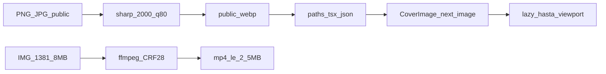

# Plan: optimizar fotos y vídeo de omio-web

Spec: [docs/superpowers/specs/2026-08-24-optimizacion-imagenes-omio-design.md](docs/superpowers/specs/2026-08-24-optimizacion-imagenes-omio-design.md)

Al implementar, copiar este plan a `docs/superpowers/plans/2026-08-24-optimizacion-imagenes-omio.md`. Rama `feat/optimizacion-imagenes` en **worktree limpio desde `origin/main`**. No tocar `messages/*`, `middleware.ts` ni `package.json` sucios de esta `main` local. `gh auth switch --user ViBaTo`. Dev en puerto **3210** (el 3000 lo usa klinikOS).

**Goal:** la home deja de descargar ~90 MB de fotos al abrir; el vídeo de portada pasa de 8 MB a ≤2,5 MB; el look no cambia.

**Architecture:** una pasada con `sharp` convierte raster en `public/images` a `.webp` (lado largo 2000, q80) y reescribe paths en código + JSON de Keystatic. Un `CoverImage` (`next/image` `fill` + `object-cover` + `sizes`) sustituye todos los `background-image` de fotos. El vídeo `IMG_1381.mp4` se recodifica in-place. Originales gordos solo en `assets_01/web-originals/` (gitignorado).

**Tech stack:** Next.js 16, `next/image`, sharp (dev), ffmpeg (CLI local), vitest (ya en el repo, include `src/**/*.test.ts`).

## Restricciones (de la spec)

- WebP, lado largo máximo 2000 px, quality 80. No agrandar.
- Vídeo en todos los tamaños; no sustituir por foto en móvil.
- No tocar SVG; Navbar/Footer siguen `unoptimized`.
- No borrar huérfanos; sí se pueden convertir.
- No limitar el CMS. No CDN nuevo. No skeleton/blur.
- Typecheck: `pnpm exec tsc --noEmit`. No usar `pnpm lint` (ya estaba roto).
- Commits: (1) reglas+script+archivos+refs, (2) CoverImage+componentes+next.config, (3) vídeo.



## Archivos

- Crear: `src/lib/images/optimize-rules.ts` + `optimize-rules.test.ts` — skip, `toWebpUrl`, rewrite de texto.
- Crear: `scripts/optimize-images.ts` — copia a `assets_01/web-originals`, sharp, borra original si ya hay webp y refs actualizadas.
- Crear: `src/components/CoverImage.tsx` + `src/lib/images/sizes.ts`.
- Modificar: `next.config.ts` (`images.formats`).
- Modificar (solo `backgroundImage` de fotos, no `style.overlay`): [HomeAtelier.tsx](src/components/home/HomeAtelier.tsx), [HomeNosotros.tsx](src/components/home/HomeNosotros.tsx), [HomeServicios.tsx](src/components/home/HomeServicios.tsx), [HomeProyectos.tsx](src/components/home/HomeProyectos.tsx), [HomeMateriales.tsx](src/components/home/HomeMateriales.tsx), [MaterialCard.tsx](src/components/MaterialCard.tsx), [ImageGallery.tsx](src/components/ImageGallery.tsx), [NosotrosContent.tsx](src/app/[locale]/nosotros/NosotrosContent.tsx), [ProyectosContent.tsx](src/app/[locale]/proyectos/ProyectosContent.tsx), [ProjectDetailContent.tsx](src/app/[locale]/proyectos/[slug]/ProjectDetailContent.tsx), [MaterialDetailContent.tsx](src/app/[locale]/materiales/[slug]/MaterialDetailContent.tsx).
- Modificar: [HeroDoor.tsx](src/components/HeroDoor.tsx) poster `.jpg` → `.webp` (el script de refs también lo hace).
- Contenido: `src/content/proyectos/*.json`, `src/content/materiales/*.json` (extensión; el doble prefijo Keystatic se queda).
- No editar a mano `src/data/_generated/` — `pnpm codegen` / `prebuild`.

## Task 1 — Worktree

- [ ] Desde el repo: worktree nuevo en `.worktrees/optimizacion-imagenes` (o el nativo del harness) branch `feat/optimizacion-imagenes` **desde `origin/main`**.
- [ ] `git status` limpio; HEAD = `origin/main`. `pnpm install`.
- [ ] Copiar el plan a `docs/superpowers/plans/2026-08-24-optimizacion-imagenes-omio.md`.

## Task 2 — Reglas + tests (TDD)

Vitest: `src/**/*.test.ts`. Extraer lógica pura para no testear sharp.

`src/lib/images/optimize-rules.ts`:

```ts
export const MAX_LONG_EDGE = 2000
export const SKIP_MAX_BYTES = 200 * 1024
export const WEBP_QUALITY = 80

export function shouldSkip(longEdge: number, bytes: number): boolean {
  return longEdge <= MAX_LONG_EDGE && bytes < SKIP_MAX_BYTES
}

export function toWebpUrl(url: string): string {
  return url.replace(/\.(png|jpe?g)(?=[?#]|$)/gi, '.webp')
}

export function rewriteImageRefs(source: string): string {
  return source.replace(
    /(["'(])([^"'()\s]+)\.(png|jpe?g)(["')])/gi,
    (_, a, path, _ext, b) => {
      if (path.includes('/images/materiales')) return `${a}${path}.${_ext}${b}`
      return `${a}${toWebpUrl(`${path}.${_ext}`)}${b}`
    }
  )
}
```

Tests en `src/lib/images/optimize-rules.test.ts` (patrón de [validar.test.ts](src/lib/contacto/validar.test.ts)):

- `shouldSkip(1600, 100_000) === true`; `shouldSkip(1600, 500_000) === false`; `shouldSkip(3908, 100_000) === false`.
- `toWebpUrl('/images/new/03.png') === '/images/new/03.webp'`.
- `toWebpUrl('/images/Recurso%201%404x.png') === '/images/Recurso%201%404x.webp'`.
- `toWebpUrl('/images/projects/foo__foo__hero.jpg')` → `.webp`.
- `rewriteImageRefs` cambia `.png`/`.jpg` en JSON y en `url('/images/new/01.png')`; **no** toca `.svg`; **no** toca paths `/images/materiales/`.

- [ ] Escribir tests, `pnpm test src/lib/images/optimize-rules.test.ts` → FAIL.
- [ ] Implementar reglas, tests PASS.

## Task 3 — Script + conversión + refs

`scripts/optimize-images.ts` (tsx, como [keystatic-codegen.ts](scripts/keystatic-codegen.ts)):

1. Recorrer `public/images/**/*.{png,jpg,jpeg}` excluyendo `public/images/materiales/`.
2. Si `shouldSkip` (medir con `sharp(file).metadata()` + `stat.size`), continuar.
3. Copiar original a `assets_01/web-originals/<relativo>` (mkdir).
4. Escribir `<basename>.webp` junto al original: `sharp(input).rotate().resize({ width: MAX_LONG_EDGE, height: MAX_LONG_EDGE, fit: 'inside', withoutEnlargement: true }).webp({ quality: WEBP_QUALITY })`.
5. Tras generar todos los webp: reescribir con `rewriteImageRefs` cada `src/**/*.{ts,tsx}` y `src/content/**/*.json`.
6. Borrar el png/jpg **solo si** existe el `.webp` hermano y `rg`/`git grep` ya no apunta al original en `src/` (salvo el propio script).
7. No tocar SVG. No tocar `public/videos` aquí.

Añadir `"optimize:images": "tsx scripts/optimize-images.ts"` en `package.json` del worktree (el de origin/main, no mezclar con la main sucia). `pnpm add -D sharp`.

- [ ] Dry-run o primera pasada; comprobar `03.webp` ≪ `03.png` (orden de cientos de KB).
- [ ] `pnpm codegen` para regenerar `_generated`.
- [ ] `pnpm exec tsc --noEmit` verde.
- [ ] Commit 1: `feat(web): convertir fotos a WebP 2000px y actualizar rutas`.

## Task 4 — CoverImage + next.config

[`src/lib/images/sizes.ts`](src/lib/images/sizes.ts):

```ts
export const IMAGE_SIZES = {
  fullBleed: '100vw',
  atelierGallery: '(max-width: 768px) 50vw, 25vw',
  card: '(max-width: 768px) 100vw, 50vw',
  projectGallery: '(max-width: 768px) 100vw, 70vw',
  thumb: '112px'
} as const
```

[`src/components/CoverImage.tsx`](src/components/CoverImage.tsx) — `'use client'` no hace falta si no hay hooks; los padres ya son client. Usar `next/image`:

```tsx
import Image from 'next/image'

type CoverImageProps = {
  src: string
  alt: string
  sizes: string
  className?: string
  priority?: boolean
  opacity?: number
}

export default function CoverImage({
  src,
  alt,
  sizes,
  className,
  priority,
  opacity
}: CoverImageProps) {
  return (
    <Image
      src={src}
      alt={alt}
      fill
      sizes={sizes}
      priority={priority}
      className={['object-cover', className].filter(Boolean).join(' ')}
      style={opacity != null ? { opacity } : undefined}
    />
  )
}
```

Padre **siempre** `relative overflow-hidden` + `aspect-*` (ya lo tienen). Hover scale en un wrapper `absolute inset-0`, no en CoverImage.

[next.config.ts](next.config.ts): `images: { formats: ['image/avif', 'image/webp'] }`. No `unoptimized: true`. No remotePatterns.

## Task 5 — Sustituir background-image

Patrón (HomeAtelier): el `div` con `bg-cover` pasa a:

```tsx
<motion.div
  className={`relative overflow-hidden ${img.aspect}`}
  variants={fadeInUp}
>
  <div className='absolute inset-0 transition-transform duration-[1.2s] hover:scale-[1.04]'>
    <CoverImage src={img.src} alt='' sizes={IMAGE_SIZES.atelierGallery} />
  </div>
</motion.div>
```

- HomeServicios: `className="grayscale contrast-[1.05]"` + `IMAGE_SIZES.fullBleed`.
- HomeNosotros / NosotrosContent: `alt=""` + `card` o `fullBleed` según ocupe media/columna.
- HomeProyectos / ProyectosContent / MaterialCard / HomeMateriales: `IMAGE_SIZES.card`. Hover scale se queda en el `motion.div` wrapper (`scale: isHovered ? 1.05 : 1`). Si `!material.image`, el gradiente `CATEGORY_GRADIENTS` se mantiene (no CoverImage).
- ProjectDetail hero: `CoverImage` + `opacity={0.7}` + `fullBleed`. El overlay gradient **encima**, z-index igual que ahora.
- `ProjectDetailContent` layouts 1/2/3/4 fotos: `projectGallery`; `alt={img.alt}` (hoy `aria-label` en un div).
- ImageGallery: imagen grande `projectGallery`; thumbs `IMAGE_SIZES.thumb`.
- MaterialDetailContent foto principal: `card`; related projects heroes: `card`.
- **No** tocar `backgroundImage: style.overlay` (gradiente CSS).

- [ ] `pnpm exec tsc --noEmit` + `pnpm build` verde.
- [ ] Commit 2: `feat(web): servir fotos con next/image y carga diferida`.

## Task 6 — Vídeo de portada

- Copiar `public/videos/IMG_1381.mp4` → `assets_01/web-originals/videos/`.
- Recodificar (ffmpeg local):

```bash
ffmpeg -y -i assets_01/web-originals/videos/IMG_1381.mp4 \
  -vf "scale='min(1920,iw)':'min(1080,ih)':force_original_aspect_ratio=decrease" \
  -c:v libx264 -crf 28 -preset medium -an -movflags +faststart \
  public/videos/IMG_1381.mp4
```

(`-an`: la UI lo deja mute; si ffmpeg no está, instalarlo; si el resultado > 2,5 MB, CRF 30).

- HeroDoor: mismo path `/videos/IMG_1381.mp4`; poster ya `.webp` tras Task 3. JSX: `autoPlay` `loop` `playsInline` `preload="metadata"` sin cambio de comportamiento.
- No WebM. No desactivar en móvil.

- [ ] `ls -lh public/videos/IMG_1381.mp4` ≤ 2,5 MB.
- [ ] Commit 3: `feat(web): recodificar vídeo de portada bajo 2,5 MB`.

## Task 7 — Verificar (obligatorio antes de dar por hecho)

Dev: `pnpm dev -- --port 3210`.

1. **Red, home `/es`, sin scroll:** las 8 de Atelier (`/images/new/03`–`10`) **no** deben transferirse al primer load. Sí: vídeo ≤ 2,5 MB + poster. Con scroll hasta Atelier, entonces sí se piden (via `/_next/image` o el webp).
2. **Look** desktop ≥1280 y viewport 390: home, `/es/proyectos`, una ficha, `/es/materiales`, una ficha, `/es/nosotros`. Mismo recorte cover, mismo hover scale, mismo grayscale de servicios, vídeo en bucle mudo.
3. `pnpm test` + `pnpm exec tsc --noEmit` + `pnpm build` verdes.

Si en iMac se viera blando un héroe: quality 85 o 2400 px **solo** en héroes de proyecto, no reabrir el resto.
